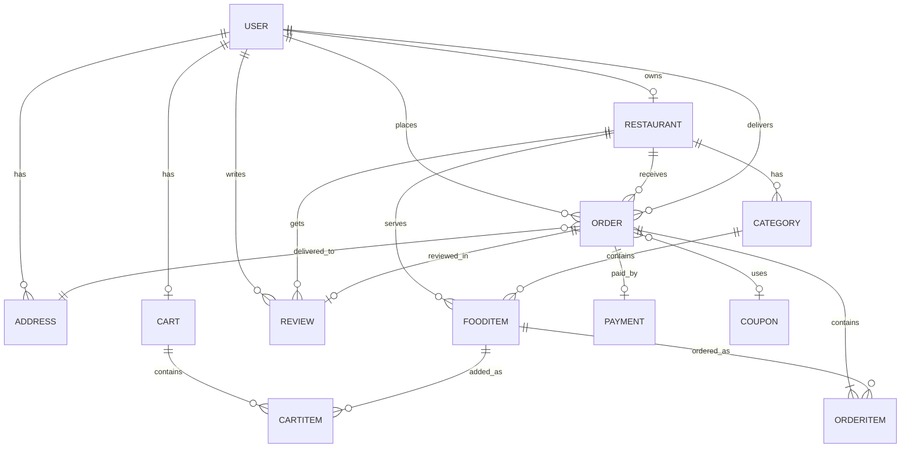

```mermaid
erDiagram
    USER ||--o{ ADDRESS : has
    USER ||--o| RESTAURANT : owns
    USER ||--o| CART : has
    USER ||--o{ ORDER : places
    USER ||--o{ REVIEW : writes
    RESTAURANT ||--o{ CATEGORY : has
    RESTAURANT ||--o{ FOODITEM : serves
    RESTAURANT ||--o{ ORDER : receives
    RESTAURANT ||--o{ REVIEW : gets
    CATEGORY ||--o{ FOODITEM : contains
    CART ||--o{ CARTITEM : contains
    FOODITEM ||--o{ CARTITEM : added_as
    ORDER ||--|{ ORDERITEM : contains
    FOODITEM ||--o{ ORDERITEM : ordered_as
    ORDER ||--o| PAYMENT : paid_by
    ORDER ||--o| REVIEW : reviewed_in
    ORDER }o--o| COUPON : uses
    ORDER }o--|| ADDRESS : delivered_to
    USER ||--o{ ORDER : delivers
```
